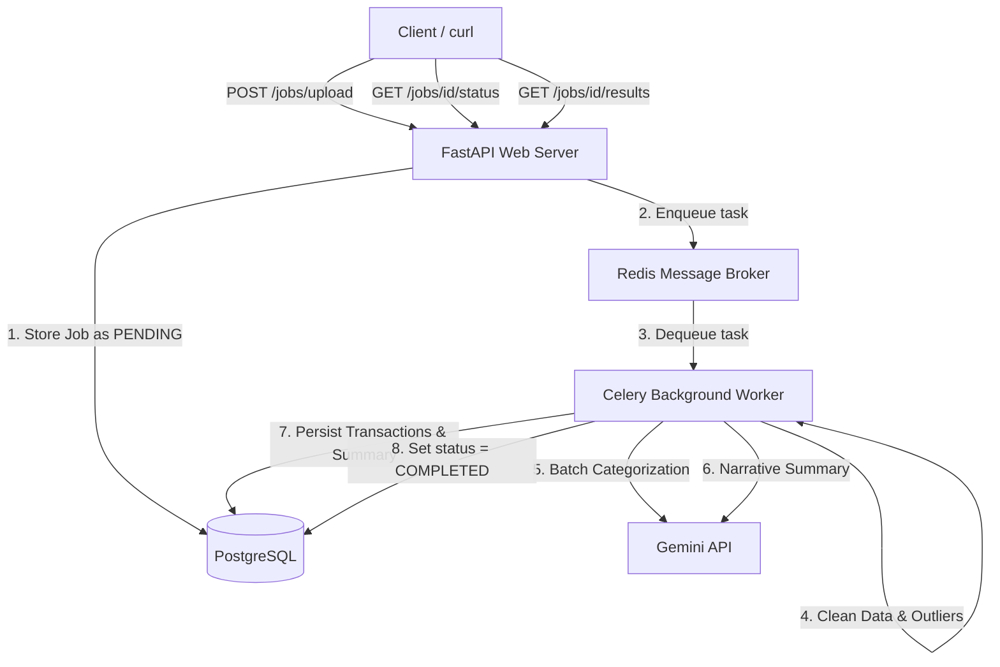

# AI-Powered Transaction Processing Pipeline

An asynchronous backend processing system built to ingest, clean, analyze, and summarize financial transactions. The system is fully containerized with Docker, processes files in the background using Celery + Redis, persists transaction logs in PostgreSQL, and integrates the Gemini API for category classification and narrative summary reporting.

---

## 🏗️ Architecture Overview



### End-to-End Processing Flow
1. **Request Ingestion**: The client uploads a CSV file via `POST /jobs/upload`. FastAPI validates the file, creates a new `Job` record in PostgreSQL with status `PENDING`, and triggers a Celery task. A `202 Accepted` status is immediately returned containing the `job_id` so the client isn't blocked.
2. **Asynchronous Execution**:
   - **Data Cleaning**: Rows are deduplicated. Date columns are normalized to ISO 8601, currency characters are stripped, statuses are upper-cased, and blank categories are set to `'Uncategorised'`. Transaction amounts are rounded to `2` decimal places to prevent floating-point anomalies.
   - **Anomaly Detection**: 
     - *Statistical Outliers*: Identifies transaction amounts exceeding 3x the median of all transaction amounts for that specific `account_id` within the dataset.
     - *Currency-Merchant Mismatch*: Flags domestic brands (e.g., Swiggy, Ola, IRCTC) where the transaction currency is set to USD.
   - **LLM Classification**: Transactions without a category are batched (20 rows per batch) and classified using the Gemini API (`gemini-flash-latest`). A robust exponential backoff-retry loop is integrated to handle API rate limits.
   - **Narrative Summary**: The worker compiles dataset aggregates (spend, anomalies, top merchants) and asks Gemini to generate a risk rating (`low`, `medium`, `high`) and a 2-3 sentence descriptive narrative.
   - **Database Insertion**: Cleaned transactions, anomalies, and summary reports are saved in PostgreSQL, and the job status is updated to `COMPLETED`.

---

## 📂 Directory Structure

```text
/async-transaction-pipeline
│   docker-compose.yml     # Docker Compose services definition
│   Dockerfile             # Multi-stage container build
│   requirements.txt       # Python dependencies
│   sample_transactions.csv# Example dirty transactions for testing
│   verify_pipeline.py     # Python verification script
│   README.md              # Documentation and guide
│
└───app
    │   __init__.py
    │   main.py            # FastAPI Entrypoint
    │   config.py          # Configuration loader
    │   database.py        # SQLAlchemy session helper
    │   models.py          # SQLAlchemy models
    │   schemas.py         # Pydantic schemas
    │   celery_app.py      # Celery broker configuration
    │
    └───api
    │   └───v1
    │       │   jobs.py    # Route definitions
    │
    └───tasks
        │   pipeline.py    # Background cleaning/LLM workers
```

---

## 🚀 Quick Start Guide

### 1. Requirements
Ensure you have the following installed on your machine:
- [Docker](https://www.docker.com/products/docker-desktop/)
- [Docker Compose](https://docs.docker.com/compose/install/)

### 2. Environment Configuration
Create a `.env` file in the root directory and add your Gemini API Key:
```env
GEMINI_API_KEY=your_gemini_api_key_here
```

### 3. Run the Containers
Spin up the entire stack (PostgreSQL, Redis, FastAPI, Celery worker) with a single command:
```bash
docker compose up --build
```
Wait for the database and services to report healthy. The API will be accessible on `http://localhost:8001`.

### 4. Run the Verification Script
Open a new terminal window and run the verification suite:
```bash
pip install requests
python verify_pipeline.py
```
This automatically posts `sample_transactions.csv` to your server, polls for status, and outputs a formatted terminal report of cleaned records, anomalies, and LLM-generated narrative reports.

---

## 🔌 API Endpoints Reference

### 1. Upload Transactions CSV
* **Endpoint**: `POST /jobs/upload`
* **Content-Type**: `multipart/form-data`
* **Request Body**: `file` (CSV File)
* **Response** (202 Accepted):
```json
{
  "job_id": "8e3bfae6-7647-4959-994b-a9b09c255280",
  "status": "pending",
  "message": "File uploaded and queued for processing"
}
```

### 2. Get Job Status
* **Endpoint**: `GET /jobs/{job_id}/status`
* **Response** (200 OK):
```json
{
  "job_id": "8e3bfae6-7647-4959-994b-a9b09c255280",
  "status": "COMPLETED",
  "filename": "sample_transactions.csv",
  "row_count_raw": 11,
  "row_count_clean": 10,
  "created_at": "2026-07-01T07:30:00.123Z",
  "completed_at": "2026-07-01T07:30:04.456Z",
  "error_message": null,
  "summary": {
    "row_count": 10,
    "anomalies": 5,
    "categories": 5,
    "total_spend_inr": 64199.00,
    "total_spend_usd": 82.50
  }
}
```

### 3. Get Job Results
* **Endpoint**: `GET /jobs/{job_id}/results`
* **Response** (200 OK): Returns all transaction details, flagged anomalies, spend breakdown by category, and narrative summary.

### 4. List All Jobs
* **Endpoint**: `GET /jobs`
* **Query Parameter** (Optional): `?status=COMPLETED`
* **Response** (200 OK):
```json
{
  "jobs": [
    {
      "id": "8e3bfae6-7647-4959-994b-a9b09c255280",
      "filename": "sample_transactions.csv",
      "status": "COMPLETED",
      "row_count_raw": 11,
      "created_at": "2026-07-01T07:30:00.123Z"
    }
  ]
}
```

### 5. Get API Health
* **Endpoint**: `GET /health`
* **Response** (200 OK):
```json
{
  "status": "healthy",
  "services": {
    "database": "healthy",
    "redis": "healthy"
  }
}
```

---

## 📹 Review Guide: Scaling & Bottlenecks

*(Use these points to structure your technical video review)*

### 1. Stack Selection
* **FastAPI**: Lightweight, asynchronous HTTP routing with automatic OpenAPI Swagger generation.
* **Celery + Redis**: Decouples API response times from heavy backend operations (network-bound LLM tasks, pandas parsing).
* **PostgreSQL**: Guarantees ACID transaction compliance and relational mappings for auditability.

### 2. High-Load Bottlenecks (at 100x traffic)
If traffic scales by 100x, the architecture faces these key bottlenecks:
* **File Storage**: The local container filesystem is ephemeral and does not scale across multiple nodes.
  * *Fix*: Upload incoming CSVs to cloud object storage (e.g. AWS S3, Google Cloud Storage) and save only metadata references in PostgreSQL.
* **LLM Rate Limits (429 Errors)**: Consecutive API calls to Gemini will fail.
  * *Fix*: Implement a Redis-backed LRU caching layer mapping `(merchant, notes) -> category` to bypass LLM classification calls for repeated merchants.
* **DB Connection Pool Exhaustion**: Standard SQLAlchemy connection configurations will run out of connection handles under high concurrent tasks.
  * *Fix*: Deploy a connection proxy like `PgBouncer` in front of PostgreSQL.
* **CPU & Memory Spikes**: Parsing huge files (100k+ rows) into memory using Pandas can crash worker containers.
  * *Fix*: Stream files chunk-by-chunk using generators (`csv.reader`) directly into staging tables.
